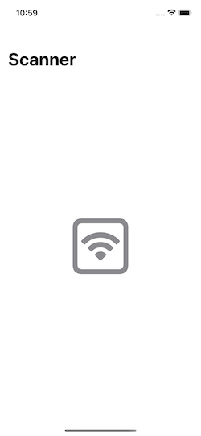
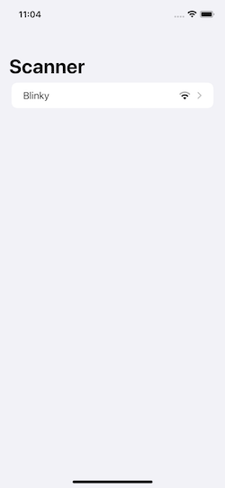
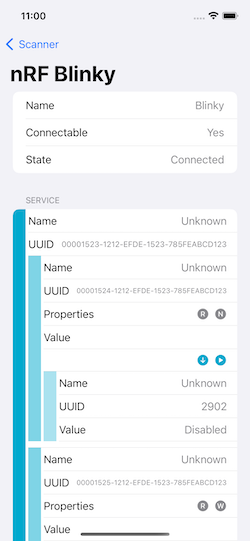

# Core Bluetooth Mock migration example

Sample iOS application demonstrating migration from native 
[CoreBluetooth](https://developer.apple.com/documentation/corebluetooth) to 
[CoreBluetooth Mock](https://github.com/NordicSemiconductor/IOS-CoreBluetooth-Mock/) library. 

> **Note**
> The documentation of the library is available [here](https://nordicsemiconductor.github.io/IOS-CoreBluetooth-Mock/documentation/corebluetoothmock).

## Application

The application has the following features:
* Scanning for Bluetooth Low Energy devices,
* Connecting and discovering services,
* Basic GATT operations (read, write, show value changes).

  

## Migration

[Pull Request #1](https://github.com/NordicSemiconductor/IOS-CoreBluetooth-Mock-Example/pull/1) applies all necessary changes for the app to work on a Simulator.

## License

BSD 3-Clause License